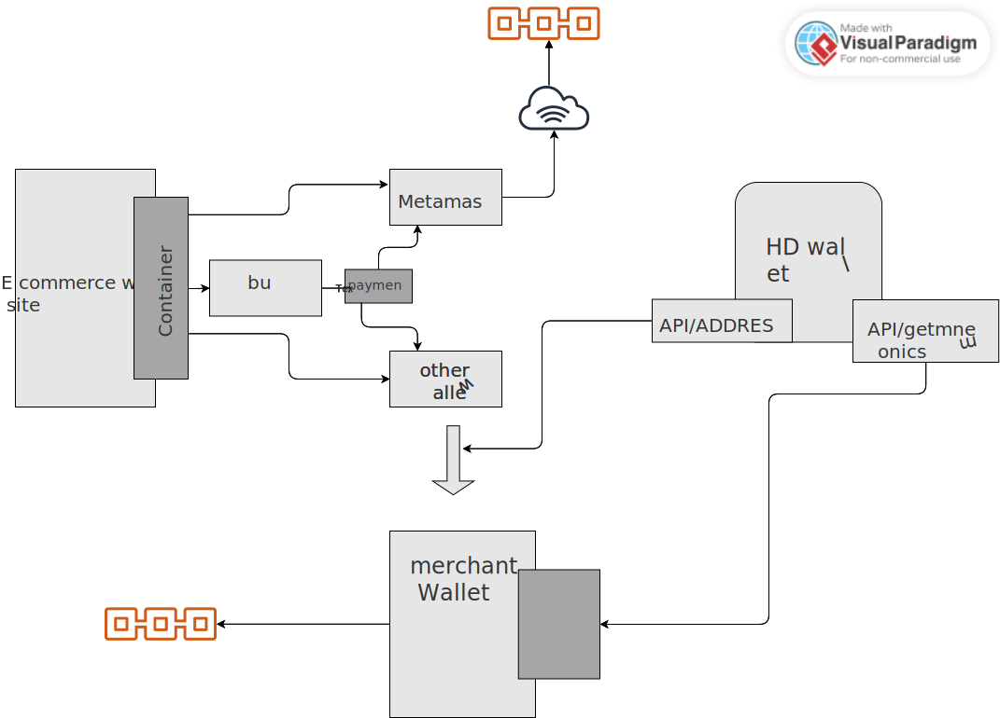

# Payment Gateway with Merchant Payment Wallet and HD Address Wallet

A payment gateway solution built on the Ethereum platform that enables users to accept payments on a blockchain network. It allows the merchant to accept ether as payment and can be easily leveraged to accept an ERC20 token as payment as well for enterprise applications not implementing cryptocurrencies.

## Technologies Used

- Merchant site and gateway: JavaScript, React, MetaMask, Web3, Node.js, Bulma CSS
- HD wallet: Node.js, Express.js, HTTPS API, BIP39, ethutil, ethtx
- Payment wallet: Ganache, Web3, React, Node.js, BIP39, HTTP API, Bulma CSS

## Key Features

- Defining blockchain payment ecosystem
- Generating dynamic merchant addresses using HD wallets
- An e-commerce website and payment gateway
- An API for generating dynamic payment addresses
- The merchant HD wallet
- Running the payment ecosystem and Ethereum blockchain

## Tags

- Ethereum
- Payment Gateway
- Blockchain
- Merchant Wallet
- HD Wallet
- Web3
- React
- JavaScript
- Node.js
- MetaMask
- Ganache
- API
- BIP39
- HTTPS
- CSS
- MIT License
